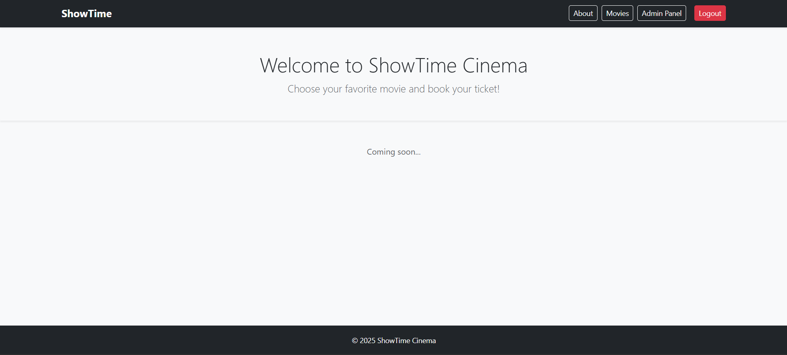
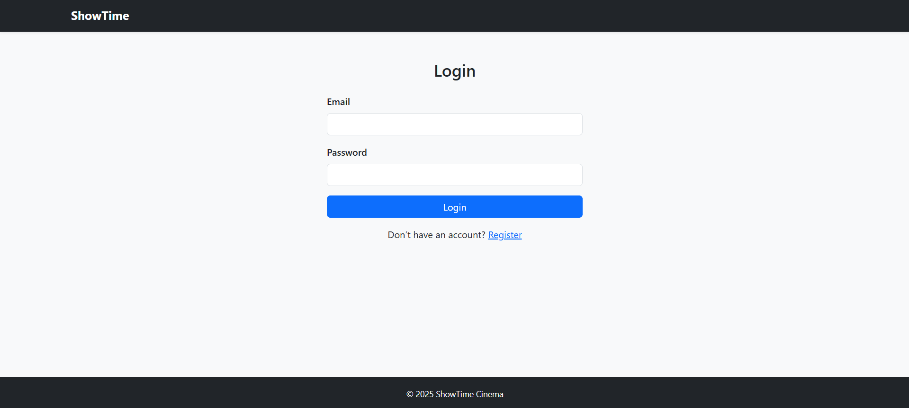
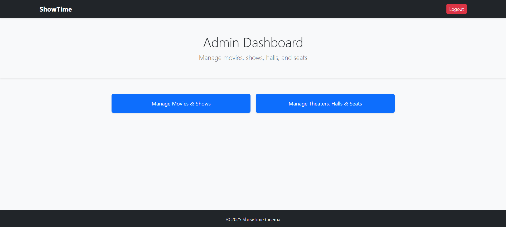
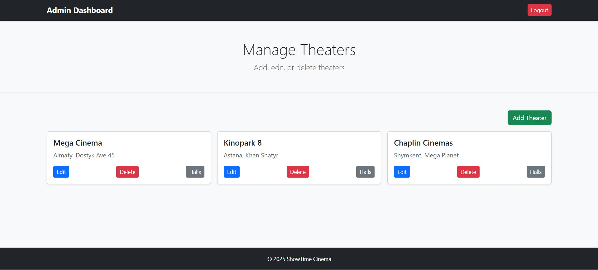
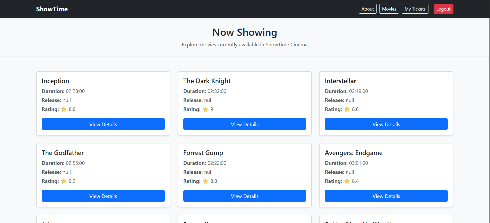

# ShowTime — Cinema Booking REST API


[](https://github.com/Ork2004/ShowTime/actions/workflows/ci.yml)

**ShowTime** is a full-stack cinema management and ticket-booking system built with **Spring Boot 3** and **PostgreSQL**. It exposes a secured REST API — with JWT authentication, role-based authorization, and layered architecture — behind a vanilla HTML/CSS/JS frontend, letting customers browse movies and book seats while admins manage the entire catalog through dedicated dashboards.

---

## Table of Contents

- [Features](#features)
- [Screenshots](#screenshots)
- [Tech Stack](#tech-stack)
- [Project Structure](#project-structure)
- [Getting Started](#getting-started)
- [Default Accounts](#default-accounts)
- [API Reference](#api-reference)
- [Authorization Model](#authorization-model)
- [Testing](#testing)
- [Possible Improvements](#possible-improvements)
- [Author](#author)

---

## Features

- **Stateless JWT authentication** with BCrypt password hashing and a custom `Spring Security` filter chain
- **Role-based authorization** (`USER` / `ADMIN`) enforced at the API layer, independent of the static frontend
- **Ticket booking with conflict protection** — booking an already-taken seat returns `409 Conflict` instead of creating a duplicate row
- **Full CRUD** for movies, genres, theaters, halls, seats, and shows, with filtering (e.g. shows by movie + theater)
- **Centralized exception handling** (`@RestControllerAdvice`) producing consistent JSON error payloads for validation, not-found, and conflict cases
- **Bean Validation** on all incoming DTOs
- **Auto-generated OpenAPI/Swagger docs** for every endpoint
- **Vanilla JS frontend** (no framework) using `fetch` + JWT stored in `localStorage`, including admin dashboards for movies, theaters, halls, and seats
- **Unit + integration test suite** covering every service and controller (JUnit 5, MockMvc, Spring Security Test)

---

## Screenshots

| Page            | Screenshot                                          |
|-----------------|-----------------------------------------------------|
| Main Page       |                      |
| Login           |                      |
| Admin Dashboard |  |
| Manage Theaters |  |
| Movie List      |            |

---

## Tech Stack

| Layer          | Technology                          |
|----------------|--------------------------------------|
| Backend        | Java 17, Spring Boot 3.5.5           |
| Persistence    | Spring Data JPA / Hibernate          |
| Database       | PostgreSQL                           |
| Security       | Spring Security, JWT (jjwt)          |
| Validation     | Jakarta Bean Validation              |
| Documentation  | Springdoc OpenAPI (Swagger UI)       |
| Build Tool     | Maven                                |
| Frontend       | HTML5, CSS3, vanilla JavaScript (Fetch API) |
| Testing        | JUnit 5, MockMvc, Spring Security Test |

---

## Project Structure

```
src/main/java/.../showtime/
├── config/          # Spring Security configuration
├── controller/       # REST controllers (Auth, Movie, Show, Theater, Hall, Seat, Genre, Ticket, User)
├── dto/               # Request/response DTOs
├── entity/            # JPA entities
├── enums/             # Role enum (USER, ADMIN)
├── exception/         # Global exception handler + custom exceptions
├── repository/        # Spring Data JPA repositories
├── security/
│   ├── jwt/           # JWT filter + token utility
│   └── service/       # UserDetailsService implementation
└── service/           # Business logic layer

src/main/resources/
├── static/            # Frontend (HTML pages, css/, js/)
└── application.properties

docs/
├── scheme.sql         # Database schema
├── data.sql           # Seed data (default users, sample catalog)
└── images/            # Screenshots used in this README
```

The app follows a classic layered architecture: **Controller → Service → Repository → Entity**, with DTOs decoupling the API contract from the persistence model.

---

## Getting Started

### Option A: Docker Compose (recommended)

Requires Docker only — no local Java, Maven, or PostgreSQL needed.

```bash
git clone https://github.com/Ork2004/ShowTime.git
cd ShowTime
cp .env.example .env   # then edit DB_PASSWORD and JWT_SECRET
docker compose up --build
```

The app starts on `http://localhost:8080` against a PostgreSQL container. Load the schema/seed data into it once it's up:

```bash
docker compose exec -T db psql -U postgres -d showtime_db < docs/scheme.sql
docker compose exec -T db psql -U postgres -d showtime_db < docs/data.sql
```

### Option B: Local Maven

**Prerequisites**
- Java 17+
- Maven 3+
- PostgreSQL running locally (or reachable via network)

**Setup**

1. Clone the repository:
   ```bash
   git clone https://github.com/Ork2004/ShowTime.git
   cd ShowTime
   ```

2. Create the database:
   ```sql
   CREATE DATABASE showtime_db;
   ```

3. Load the schema and seed data:
   ```bash
   psql -U postgres -d showtime_db -f docs/scheme.sql
   psql -U postgres -d showtime_db -f docs/data.sql
   ```

4. `DB_PASSWORD` and `JWT_SECRET` have no default and must be set, or the app won't start:
   ```bash
   export DB_URL=jdbc:postgresql://localhost:5432/showtime_db
   export DB_USERNAME=postgres
   export DB_PASSWORD=your_password
   export JWT_SECRET=your_own_secret   # e.g. output of: openssl rand -hex 64
   ```

5. Run the application:
   ```bash
   ./mvnw spring-boot:run
   ```

6. Open in your browser:
   - Frontend: `http://localhost:8080`
   - Swagger UI: `http://localhost:8080/swagger-ui/index.html`

---

## Default Accounts

Seeded via `docs/data.sql`:

| Role  | Email                | Password  |
|-------|-----------------------|-----------|
| Admin | `admin@example.com`  | `admin123` |
| User  | `user@example.com`   | `user123`  |

---

## API Reference

Full interactive documentation is available via **[Swagger UI](http://localhost:8080/swagger-ui/index.html)** once the app is running. Highlights:

| Method | Endpoint                                       | Access      | Description                          |
|--------|-------------------------------------------------|-------------|---------------------------------------|
| POST   | `/auth/register`                                | Public      | Register a new user                   |
| POST   | `/auth/login`                                   | Public      | Authenticate and receive a JWT        |
| GET    | `/movies`, `/movies/{id}`                       | Public      | Browse movies                         |
| GET    | `/movies/{id}/shows`                            | Public      | List showtimes for a movie            |
| GET    | `/theaters/{id}/halls/{id}/seats`                | Public      | View the seat map of a hall           |
| GET/POST/DELETE | `/users/{userId}/tickets`               | User        | View, book, and cancel tickets        |
| POST/PUT/DELETE | `/movies`, `/movies/{id}`               | Admin       | Manage movies                         |
| CRUD   | `/genres`                                       | Admin       | Manage genres                         |
| CRUD   | `/theaters`, `.../halls`, `.../seats`           | Admin       | Manage theaters, halls, and seats     |
| POST/PUT/DELETE | `/movies/{id}/shows`                    | Admin       | Manage showtimes                      |

---

## Authorization Model

Access is enforced with Spring Security using a stateless JWT filter chain:

- **Public** — auth endpoints, static frontend pages, Swagger, and read-only browsing (movies, shows, seat maps)
- **`ROLE_USER`** — book, view, and cancel their own tickets (`/users/{userId}/tickets/**`)
- **`ROLE_ADMIN`** — full catalog management: genres, movies, shows, theaters, halls, and seats
- **Denied** — direct access to `/users/**` (listing/creating/deleting user accounts) is blocked for everyone; user records are only ever exposed through `/auth/**` and the ticket endpoints

> Note: admin HTML pages (e.g. `admin-dashboard.html`) are served publicly so the SPA can load — actual data access is still gated by the JWT + role checks on the underlying API calls.

---

## Testing

Run the full suite with:

```bash
./mvnw test
```

The project includes:
- **Unit tests** for every service class (business logic, mocked repositories)
- **Integration tests** for every controller (`@SpringBootTest` + `MockMvc`, covering auth, validation, and error responses)

---

## Possible Improvements

- Add refresh tokens and token revocation
- Add pagination for movie/show listings
- Deploy a live demo (Railway/Render/Fly.io)

---

## Author

**Orken Zhumagul**
[Email](mailto:zhumagul.orken@gmail.com) · [GitHub](https://github.com/Ork2004)
